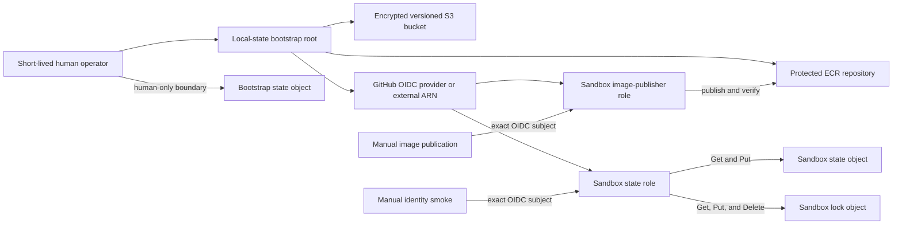
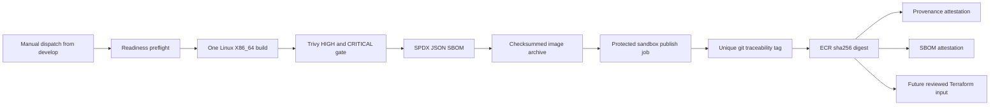
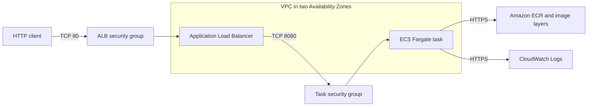

# Architecture overview

## Status and scope

Terraform represents a disposable sandbox runtime plus a longer-lived state,
identity, and artifact bootstrap. `deployment_enabled` and `bootstrap_enabled`
both default to `false`; local plans contain zero AWS resource changes and do
not authenticate to AWS. The bootstrap has been applied and verified from local
state, the protected GitHub environment and OIDC smoke are operational, and two
immutable images have been pushed. The first publication stopped while ECR Basic
scanning remained `IN_PROGRESS`; the later run exposed an attestation registry
credential compatibility gap. Bootstrap state has not been migrated and the
runtime has not been initialized or applied.

## State, identity, and artifact bootstrap



The bootstrap root is isolated under `infra/bootstrap` and initially keeps
local state. With a created GitHub provider it represents 14 AWS resources:
seven state-bucket resources, the provider, state role and policy, ECR
repository and lifecycle policy, and image-publisher role and policy.
Referencing an existing account-level provider reduces the inventory to 13 and
never manages the shared provider.

The bucket has no ACL, website, Object Lock, replication, cross-account grant,
or logging bucket. It uses Bucket Owner Enforced ownership, all four public
access blocks, AES-256 default encryption, versioning, accidental-destroy
protection, a 90-day noncurrent-version recovery window, and seven-day cleanup
of incomplete multipart uploads. Current state never expires.

The partial runtime S3 backend uses encryption and native `.tflock` locking.
Credentials remain process-local from a future short-lived OIDC session and
must never enter backend configuration. DynamoDB locking is not used.

The ECR repository uses immutable tags, scan on push, SSE-S3,
`force_delete=false`, mandatory tags, and `prevent_destroy=true`. Its only
lifecycle rule expires older application subject images after more than 30
`git-` tags exist. No generic untagged rule exists until OCI 1.1 referrer
behavior is previewed in the target account. Provenance, SBOMs, and future
signatures consume storage and quota; attached reference artifacts should
follow their subject through ECR lifecycle handling. ECR Basic scanning is
asynchronous advisory evidence; the pre-authentication Trivy scan is the
authoritative publication gate.

## State keys and permissions

| Object | Owner | Allowed object actions |
| --- | --- | --- |
| `staff-aws-platform-blueprint/bootstrap/terraform.tfstate` | Human bootstrap operator | Not granted to GitHub |
| `staff-aws-platform-blueprint/bootstrap/terraform.tfstate.tflock` | Human bootstrap operator | Not granted to GitHub |
| `staff-aws-platform-blueprint/sandbox/terraform.tfstate` | GitHub sandbox state role | `GetObject`, `PutObject` |
| `staff-aws-platform-blueprint/sandbox/terraform.tfstate.tflock` | GitHub sandbox state role | `GetObject`, `PutObject`, `DeleteObject` |

The state role may list only the exact sandbox state and lock prefixes and read
bucket location, versioning, encryption, and public-access-block settings. It
has no workload-management action, state deletion, role chaining, or bootstrap
state access.

## GitHub identity boundary

GitHub API evidence on 2026-07-27 returned owner ID `1413054`, repository ID
`1314297578`, and immutable prefix
`repo:renanfenrich@1413054/staff-aws-platform-blueprint@1314297578`. The role
therefore requires:

```text
aud = sts.amazonaws.com
sub = repo:renanfenrich@1413054/staff-aws-platform-blueprint@1314297578:environment:sandbox
```

Both state and publisher trusts use `StringEquals`. The provider URL is exactly
`https://token.actions.githubusercontent.com`; no maintained certificate
thumbprint is configured. The role session maximum is one hour, while the smoke
and publication workflows request 15 minutes.

Only the manual identity job and manual publication job that enter `sandbox`
receive `id-token: write`. Each preflight runs without an environment or OIDC
permission and requires operator readiness before dynamically resolving
`sandbox`. The publication build job receives neither AWS credentials nor OIDC.
The `sandbox` environment is restricted to `develop`, has a required reviewer,
and was exercised by the successful OIDC smoke.

## Build-once publication path



The workflow accepts no publication input and rejects every dispatch ref except
`refs/heads/develop`. The image is scanned and its SBOM generated before the
publish job requests a 900-second AWS session. The image archive is retained
for one day only, verified after download, loaded, and pushed without a second
build. Security and publication evidence are retained for 14 days.

The traceability tag is never a deployment identity. The publish job resolves
it to `ECR_REPOSITORY_URL@sha256:DIGEST`, creates both attestations against the
same subject name and digest, verifies their signatures for this source
repository, and checks ECR referrers. The workflow reserves an absent default
Docker configuration path, so ECR login and `actions/attest` use the same
standard registry credential source; its `always()` cleanup logs out and
removes that file. It does not wait for asynchronous ECR Basic findings or run
Terraform or ECS commands.

## Implemented sandbox architecture



The VPC has DNS support and hostnames, two `/24` public subnets in distinct
Availability Zones, one internet gateway, one public route table, one default
IPv4 route, and an association for each subnet. There is no NAT gateway. ECS
assigns each sandbox task a public IPv4 address for outbound traffic; subnet
automatic public-address assignment remains disabled.

## Resource inventory

With `deployment_enabled=true`, runtime Terraform represents 26 resource
instances:

| Boundary | Resources |
| --- | --- |
| Network | 1 VPC, 2 public subnets, 1 internet gateway, 1 route table, 1 default route, 2 route-table associations |
| Network security | 2 security groups and 6 standalone ingress or egress rules |
| Runtime IAM | 2 roles and 1 inline execution policy |
| Entry point | 1 ALB, 1 IP target group, and 1 HTTP listener |
| Compute | 1 ECS cluster, 1 Fargate task definition, and 1 ECS service |
| Observability | 1 CloudWatch log group |

The runtime owns no registry resource. It receives the external repository ARN
for execution-role pull permissions, the matching private repository URL, and
an image that is exactly that URL plus a `sha256` digest. Mutable, `latest`,
cross-repository, malformed, and mismatched ARN/URL inputs fail validation.

## Request, image-pull, and logging paths

The exact request path is:

```text
internet TCP/80
-> ALB security group
-> HTTP listener
-> IP target group TCP/8080 with GET /ready health checks
-> task security group allowing TCP/8080 only from the ALB security group
-> non-root application container
```

No task ingress rule contains a public CIDR. SSH, administrative ports, ECS
Exec, and unrestricted security-group egress are absent.

The image-pull path is:

```text
ECS agent using the task execution role
-> ecr:GetAuthorizationToken on Resource "*"
-> BatchCheckLayerAvailability, GetDownloadUrlForLayer, and BatchGetImage
   on the project ECR repository
-> task ENI TCP/443 through its public IPv4 address and internet gateway
-> ECR and signed image-layer endpoints
```

`ecr:GetAuthorizationToken` cannot be resource-scoped by AWS. All repository
read actions are limited to the project repository ARN.

The logging path is:

```text
application structured JSON on stdout/stderr
-> ECS awslogs driver
-> execution-role CreateLogStream and PutLogEvents
-> project CloudWatch log group
```

Log permissions are scoped to streams under that log group. Retention defaults
to seven days, and the log group is disposable with the sandbox.

## Security and IAM boundaries

- The internet crosses only the sandbox ALB on TCP port 80.
- ALB egress is only TCP port 8080 to the task security group.
- Task ingress is only TCP port 8080 from the ALB security group.
- Task egress is TCP port 443 to public endpoints and TCP or UDP port 53 to the
  VPC resolver. Public HTTPS egress is the documented exception required by the
  no-NAT sandbox.
- Both ECS roles trust only `ecs-tasks.amazonaws.com`.
- The task execution role has only ECR-pull and log-delivery actions.
- The image-publisher role is separate from state and runtime identities. Its
  only wildcard resource is `ecr:GetAuthorizationToken`, which AWS cannot
  resource-scope. Layer upload, manifest publication, image reads, repository
  inspection, digest resolution, and referrer reads are scoped to the exact ECR
  ARN. It cannot read scan findings, delete images, or modify the repository.
- The application task role has no policies because the API uses no AWS API.
- The container runs as UID 1000 with a read-only root filesystem, no
  privileged mode, and all Linux capabilities dropped.
- The task definition accepts only digest-form image references and explicitly
  selects Linux on X86_64, Fargate, `awsvpc`, 0.25 vCPU, and 0.5 GiB defaults.
- The service uses one task by default, two subnets, Fargate platform `1.4.0`,
  a deployment circuit breaker, and automatic rollback.

## Cost gate and sandbox cost model

Every runtime module uses `deployment_enabled`; every bootstrap module uses
`bootstrap_enabled`. Both default to `false`, disabled outputs are null or
empty, and JSON checks reject any resource change. Local plans use non-secret,
process-local provider placeholders because the AWS provider SDK requires a
credential-shaped value. Provider validation, metadata lookup, account lookup,
refresh, and all resource creation remain disabled.

The enabled sandbox cost equation is:

```text
Fargate vCPU-seconds + Fargate GB-seconds
+ ALB-hours + LCUs + public IPv4
+ ECR storage and requests + CloudWatch log ingestion and storage
+ data transfer
```

The one-task 0.25-vCPU/0.5-GiB defaults and seven-day log retention reduce cost.
The ALB and public IPv4 addresses still have standing charges while deployed.
The bootstrap-owned ECR lifecycle retains at most 30 `git-` subject images.
Repository force deletion is disabled and accidental destroy is blocked.
Attestations and SBOMs add storage cost; lifecycle preview is required before
the first apply.

NAT gateways are deferred because their hourly and per-GB charges are poor
defaults for a disposable exercise. The task HTTPS rule is consequently broad
by destination but narrow by port. Reconsider NAT versus VPC endpoints with a
traffic and availability estimate before production.

## Deferred production architecture

This sandbox is intentionally not production-ready. Production requires:

- private application subnets and redundant reviewed egress;
- ACM-managed TLS, DNS ownership review, HTTPS redirect, and certificate
  renewal ownership;
- ALB access logs and a WAF and rate-control decision;
- capacity, autoscaling, dashboards, alarms, notification, and SLO decisions;
- operational bootstrap and migration of the represented remote state and OIDC
  foundation, plus approved plan/apply/destroy workflows and drift controls;
- operational execution and verification of the represented build-once image
  publication workflow, followed by separate plan and deployment workflows;
- budget alerts and an operationally tested rollback and recovery path.

TLS is deferred because this slice has neither an owned DNS name nor ACM
certificate lifecycle. The HTTP listener is acceptable only for the disposable
sandbox and has a time-bounded Trivy exception.

## Threat model

| Threat | Current control | Residual risk |
| --- | --- | --- |
| Public state exposure | Full public-access block, ownership enforcement, no public allow | Controls are represented but not deployed |
| State interception | TLS-only bucket policy | A misconfigured external client could still fail closed |
| State loss | Versioning and 90-day noncurrent retention | Recovery is not operationally tested |
| Concurrent writes | Native S3 lockfile | Orphaned locks still require operator judgment |
| Lock tampering | Exact lockfile object permissions | Trusted state sessions can remove their own lock |
| State deletion | No `DeleteObject` on the state object | An AWS administrator remains outside this role boundary |
| OIDC confused deputy | Exact audience and exact subject | Trusted workflow compromise remains possible |
| Repository rename ambiguity | Verified immutable owner and repository IDs | GitHub configuration drift could invalidate trust |
| Untrusted PR assumes AWS role | Manual workflow and protected `develop`-only environment | Trusted reviewer compromise remains possible |
| OIDC token theft | 15-minute smoke session and no token logging | A stolen live token remains usable until expiry |
| Shared provider deletion | External-provider reference mode | Account administrators own shared-provider availability |
| Bootstrap state compromise | Human-only bootstrap state boundary | Local state needs careful temporary protection |
| Workflow permission escalation | Job-level `id-token: write` only | A malicious trusted workflow change needs repository review controls |
| Direct task compromise | No public task ingress; ALB-to-task SG reference | Public task IP still reaches approved outbound destinations |
| First-deployment circular dependency | Registry lifecycle separated from runtime | Runtime publication and plan remain manual |
| Malicious pull request publishes image | Manual dispatch, protected environment, and exact OIDC subject | Trusted reviewers can still approve harmful code |
| Mutable image substitution | Immutable tags and digest-only runtime reference | Promotion has not been operationally tested |
| Different image scanned and pushed | One build and archive SHA-256 verification | Hosted-runner compromise remains possible |
| Vulnerable image publication | Trivy gate before AWS authentication | Scanner coverage and vulnerability data can be incomplete |
| Delayed registry findings | ECR scan on push retained as asynchronous advisory evidence | No automated post-publication response exists |
| Incomplete dependency evidence | SPDX SBOM from the exact image | SBOM accuracy depends on scanner detection |
| Forged provenance | GitHub signed digest-bound attestation | Trusted workflow compromise can attest malicious output |
| SBOM and image mismatch | Same subject digest for provenance and SBOM | Attestation has not been operationally verified |
| Wrong AWS account publication | STS account and registry account comparison | Incorrect approved environment variables can block the run |
| Wrong repository publication | Exact variables, repository inspection, and IAM ARN | Account administrators remain outside the role boundary |
| Publisher deletes evidence | No image or repository delete action | AWS administrators can still delete artifacts |
| Workflow credential exposure | 15-minute OIDC session, masked registry password, no token logging | A stolen live session remains usable until expiry |
| Attestation removed too early | Subject-focused ECR lifecycle and no untagged cleanup | OCI lifecycle behavior still needs account preview |
| Build output tampering between jobs | Run-scoped archive and SHA-256 verification | GitHub artifact service remains trusted |
| Concurrent duplicate publication | SHA-scoped concurrency without cancellation | Sequential attempts can still publish distinct trace tags |
| Trusted workflow compromise | Environment approval and small reviewed workflow boundary | Trusted maintainers can approve harmful code |
| Destructive deployment | No apply or destroy workflow exists | Manual out-of-band operations could bypass controls |
