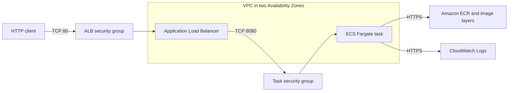

# Architecture overview

## Status and scope

Terraform represents the disposable sandbox network and ECS runtime described
below. `deployment_enabled` defaults to `false`, so the normal local plan has
zero AWS resource changes and does not authenticate to AWS. The enabled graph
has been validated only with Terraform's mock AWS provider; it has not been
applied or operationally tested in AWS.

## Implemented sandbox architecture



The VPC has DNS support and hostnames, two `/24` public subnets in distinct
Availability Zones, one internet gateway, one public route table, one default
IPv4 route, and an association for each subnet. There is no NAT gateway. ECS
assigns each sandbox task a public IPv4 address for outbound traffic; subnet
automatic public-address assignment remains disabled.

## Resource inventory

With `deployment_enabled=true`, Terraform represents 28 resource instances:

| Boundary | Resources |
| --- | --- |
| Network | 1 VPC, 2 public subnets, 1 internet gateway, 1 route table, 1 default route, 2 route-table associations |
| Network security | 2 security groups and 6 standalone ingress or egress rules |
| Registry | 1 ECR repository and 1 lifecycle policy |
| Runtime IAM | 2 roles and 1 inline execution policy |
| Entry point | 1 ALB, 1 IP target group, and 1 HTTP listener |
| Compute | 1 ECS cluster, 1 Fargate task definition, and 1 ECS service |
| Observability | 1 CloudWatch log group |

## Request, image-pull, and logging paths

The exact request path is:

```text
internet TCP/80
-> ALB security group
-> HTTP listener
-> IP target group TCP/8080 with GET /ready health checks
-> task security group allowing TCP/8080 only from the ALB security group
-> non-root application container
```

No task ingress rule contains a public CIDR. SSH, administrative ports, ECS
Exec, and unrestricted security-group egress are absent.

The image-pull path is:

```text
ECS agent using the task execution role
-> ecr:GetAuthorizationToken on Resource "*"
-> BatchCheckLayerAvailability, GetDownloadUrlForLayer, and BatchGetImage
   on the project ECR repository
-> task ENI TCP/443 through its public IPv4 address and internet gateway
-> ECR and signed image-layer endpoints
```

`ecr:GetAuthorizationToken` cannot be resource-scoped by AWS. All repository
read actions are limited to the project repository ARN.

The logging path is:

```text
application structured JSON on stdout/stderr
-> ECS awslogs driver
-> execution-role CreateLogStream and PutLogEvents
-> project CloudWatch log group
```

Log permissions are scoped to streams under that log group. Retention defaults
to seven days, and the log group is disposable with the sandbox.

## Security and IAM boundaries

- The internet crosses only the sandbox ALB on TCP port 80.
- ALB egress is only TCP port 8080 to the task security group.
- Task ingress is only TCP port 8080 from the ALB security group.
- Task egress is TCP port 443 to public endpoints and TCP or UDP port 53 to the
  VPC resolver. Public HTTPS egress is the documented exception required by the
  no-NAT sandbox.
- Both ECS roles trust only `ecs-tasks.amazonaws.com`.
- The task execution role has only ECR-pull and log-delivery actions.
- The application task role has no policies because the API uses no AWS API.
- The container runs as UID 1000 with a read-only root filesystem, no
  privileged mode, and all Linux capabilities dropped.
- The task definition accepts only digest-form image references and explicitly
  selects Linux on X86_64, Fargate, `awsvpc`, 0.25 vCPU, and 0.5 GiB defaults.
- The service uses one task by default, two subnets, Fargate platform `1.4.0`,
  a deployment circuit breaker, and automatic rollback.

## Cost gate and sandbox cost model

Every cost-bearing module uses the root `deployment_enabled` gate. Its default
is `false`; disabled outputs are null or empty. The local plan uses non-secret,
process-local provider placeholders because the AWS provider SDK requires a
credential-shaped value, while provider validation, metadata lookup, account
lookup, refresh, and all resource creation are disabled. A plan JSON check
fails if any AWS resource change appears.

The enabled sandbox cost equation is:

```text
Fargate vCPU-seconds + Fargate GB-seconds
+ ALB-hours + LCUs + public IPv4
+ ECR storage and requests + CloudWatch log ingestion and storage
+ data transfer
```

The one-task 0.25-vCPU/0.5-GiB defaults and seven-day log retention reduce cost.
The ALB and public IPv4 addresses still have standing charges while deployed.
ECR lifecycle rules expire untagged images after seven days and retain at most
30 images. Repository force deletion is disabled by default.

NAT gateways are deferred because their hourly and per-GB charges are poor
defaults for a disposable exercise. The task HTTPS rule is consequently broad
by destination but narrow by port. Reconsider NAT versus VPC endpoints with a
traffic and availability estimate before production.

## Deferred production architecture

This sandbox is intentionally not production-ready. Production requires:

- private application subnets and redundant reviewed egress;
- ACM-managed TLS, DNS ownership review, HTTPS redirect, and certificate
  renewal ownership;
- ALB access logs and a WAF and rate-control decision;
- capacity, autoscaling, dashboards, alarms, notification, and SLO decisions;
- encrypted remote state, GitHub OIDC, approved plan/apply/destroy workflows,
  and drift controls;
- a build-once workflow that scans, attests, pushes, and deploys one digest;
- budget alerts and an operationally tested rollback and recovery path.

TLS is deferred because this slice has neither an owned DNS name nor ACM
certificate lifecycle. The HTTP listener is acceptable only for the disposable
sandbox and has a time-bounded Trivy exception.

## Threat model

| Threat | Current boundary | Residual risk |
| --- | --- | --- |
| Direct task compromise | No public task ingress; ALB-to-task SG reference | Public task IP still reaches approved outbound destinations |
| Role escalation | Empty app role; explicit execution policy | Compromised task can use its execution path through the ECS agent |
| Supply-chain tampering | Digest-only input, immutable ECR tags, scan-on-push | Image build, attestation, and publish workflow is not implemented |
| Public API abuse | ALB-only ingress and invalid-header dropping | HTTP lacks TLS; WAF, rate controls, and alarms are deferred |
| Cost exhaustion | Default-disabled graph, small task, no NAT, bounded logs/images | ALB and public IPv4 accrue charges while enabled |
| Destructive deployment | No apply or destroy workflow exists | A manual out-of-band apply would bypass intended controls |
| State loss | No remote state exists and no apply has occurred | Remote-state bootstrap remains a prerequisite |
