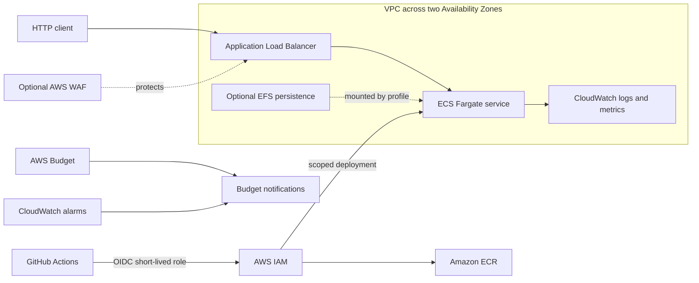

# Architecture overview

## Status and scope

The repository currently implements the API, hardened container, validation
pipeline, and Terraform input contract. The diagram below is the target AWS
architecture for the next slices; no AWS resources exist in this foundation
slice.

## Target architecture



## Request and delivery paths

1. The public ALB terminates TLS and forwards only to the task security group.
2. ECS Fargate runs the immutable image as a non-root user with a read-only root
   filesystem. `/health` tests process liveness; `/ready` controls ALB routing.
3. Application logs are JSON on standard output and flow to CloudWatch.
4. GitHub Actions exchanges its repository and environment identity for a
   short-lived AWS role. No permanent AWS access keys are permitted.
5. Images are addressed by digest in task definitions. Promotion reuses an
   already-scanned image rather than rebuilding it.

## Network profiles

The disposable sandbox will avoid a continuously billed NAT gateway. Tasks may
use public egress addresses, but their security group accepts inbound traffic
only from the ALB security group. The production profile will place tasks in
private subnets and require an explicit choice between redundant NAT gateways
and VPC endpoints. That choice must include a traffic-based cost comparison.

Two Availability Zones are the default reliability boundary. A single-AZ or
single-NAT mode must never be represented as production-ready.

## Security boundaries

- Internet traffic crosses only the ALB, and optionally WAF.
- ALB and task security groups reference each other instead of broad CIDRs.
- The task execution role is limited to image pull and log delivery.
- The application task role starts with no permissions and gains only
  workload-specific actions.
- The GitHub OIDC trust policy binds repository, branch or environment, and
  audience claims. Production uses a protected GitHub environment.
- Terraform state will use encrypted S3 with versioning and lockfiles. State
  bootstrap is a separate, explicitly approved operation.
- Secrets belong in AWS Secrets Manager or SSM Parameter Store and are never
  Terraform outputs, repository variables, logs, or image layers.

## Reliability model

- Desired count of two and multi-AZ placement are production defaults.
- ALB health checks use `/ready`; container health uses `/health`.
- ECS deployment circuit breaker and automatic rollback protect releases.
- Graceful shutdown marks the task unready before draining connections.
- Alarms cover healthy host count, HTTP 5xx, target response time, CPU, memory,
  task count, and log error rate.
- Logs have bounded retention. Alarm delivery requires a tested notification
  destination.

## Threat model

| Threat | Boundary or mitigation | Residual risk |
| --- | --- | --- |
| Stolen AWS credentials | GitHub OIDC and short sessions; no static keys | Compromised trusted workflow can request a session |
| Supply-chain tampering | Exact dependency, image, tool, and action pins; scans and SBOM | A trusted upstream release can still be malicious |
| Public API abuse | ALB controls, rate-aware alarms, optional WAF | WAF is off in the cost-minimal sandbox |
| Lateral movement | Separate ALB/task security groups and least-privilege roles | Runtime or kernel vulnerabilities remain possible |
| Secret disclosure | No repository credentials; log discipline; managed secret stores | Application code could log a future secret |
| Destructive deployment | Reviewed plans, environment approval, explicit destroy workflow | Authorized operators can still approve a bad plan |
| Cost exhaustion | Default-disabled resources, budgets, on-demand sandbox, WAF toggle | Budgets alert after usage and do not cap spend |
| State loss or corruption | Versioned encrypted state and lockfile design | Bootstrap is not implemented yet |

## Cost model

The sandbox is destroyed when not in use. Its cost equation is:

```text
Fargate vCPU-seconds + Fargate GB-seconds
+ ALB-hours + LCUs + public IPv4
+ logs, image storage, requests, and data transfer
+ optional WAF, EFS, NAT, or VPC endpoints
```

Fargate charges by requested CPU, memory, and storage over task duration;
ALB charges by running hours and capacity units. NAT gateways add hourly and
per-GB processing charges, so they are excluded from the default sandbox.
WAF adds ACL, rule, and request charges and remains opt-in. Verify the estimate
for the chosen region in the
[AWS Pricing Calculator](https://calculator.aws/) before deployment.

Pricing references:

- [AWS Fargate pricing](https://aws.amazon.com/fargate/pricing/)
- [Elastic Load Balancing pricing](https://aws.amazon.com/elasticloadbalancing/pricing/)
- [NAT gateway pricing guidance](https://docs.aws.amazon.com/vpc/latest/userguide/nat-gateway-pricing.html)
- [AWS WAF pricing](https://aws.amazon.com/waf/pricing/)

The initial monthly budget input is USD 25. This is an alert threshold, not a
spend limit. The implementation slice must add forecast and actual alerts and
document recipient verification.

## Mandatory tags

Every resource must inherit:

- `Project`
- `Environment`
- `ManagedBy`
- `Owner`
- `CostCenter`

Policy checks must fail plans with missing or empty tags.
