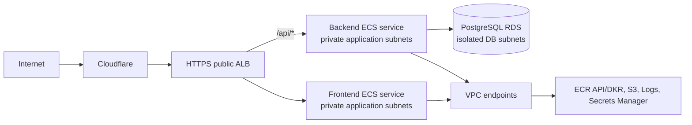

# P1 architecture and gap analysis

## Purpose and evidence boundary

This assessment records the repository state inspected on 2026-09-17 and plans
the next reviewable slices. It does not change the runtime graph, contact AWS,
or claim a new deployment. "Implemented" below means represented in committed
code unless a row explicitly identifies repository-recorded operational
evidence. No AWS API, Cloudflare, GitHub environment, or live endpoint query
was performed for this assessment.

The target remains a **production-oriented reference architecture**, not a
production environment. The current `deployment_enabled = false` and
`bootstrap_enabled = false` defaults are preserved.

## 1. Current architecture inventory

The repository is a dependency-light Node.js 24 HTTP API and a Terraform AWS
blueprint. The API supplies structured logs, graceful shutdown, `/health`,
`/ready`, and one unauthenticated greeting endpoint. Its container is
multi-stage, digest-pinned, X86_64, non-root, and compatible with a read-only
root filesystem.

Before P3, the enabled runtime was a single public-facing ALB, one ECS Fargate
service and task definition, public subnets in two Availability Zones, and a
public-IP task. P3 replaces that represented path with public ALB subnets,
private ECS application subnets, ECR/Logs interface endpoints, and an S3 gateway
endpoint. The ALB still forwards HTTP port 80 to one target group on port 8080;
task ingress remains ALB-SG-only, task public IPs and broad HTTPS egress are
removed, and there is no NAT gateway.

Bootstrap is deliberately separate from the disposable runtime. It represents
the S3 state bucket and lock objects, GitHub OIDC foundation, immutable ECR
repository, and a distinct image-publisher role. The runtime consumes a
validated external ECR repository URL and an image reference in exact digest
form; it never owns or deletes the registry.

## 2. Current security-control inventory

| Control | Current implementation | Gap to target |
| --- | --- | --- |
| Cost gate | Runtime and bootstrap graphs default to disabled. | No protected runtime deploy/destroy lifecycle yet. |
| Network ingress | Task SG ingress is referenced only from ALB SG. | Live deployment evidence is absent. |
| Egress | DNS is limited to the VPC resolver; HTTPS references endpoint SG/S3 prefix list only. | Live endpoint connectivity is unproven. |
| Container hardening | Non-root UID, read-only root filesystem, no privileged mode, drop `ALL` capabilities. | Verify frontend and migration-task equivalents. |
| Image identity | Immutable ECR, pre-auth Trivy gate, SPDX SBOM, provenance/SBOM attestations, digest-only runtime input. | Split artifacts for frontend/backend and connect reviewed digests to deploy. |
| AWS federation | Exact repository-ID/environment GitHub OIDC trust and short sessions. | Separate plan/deploy identities and protected workflows. |
| State | Encrypted/versioned S3 design with native S3 locks and least-privilege state role. | Bootstrap state migration and runtime remote initialization are human-gated and incomplete. |
| Secrets | No plaintext credentials are stored in current code or Terraform. | No Secrets Manager, database secret injection, or rotation model exists. |
| Observability | JSON application logs and bounded CloudWatch log retention. | No alarms, dashboards, ALB access logs, or runtime evidence collector. |

Existing controls include pinned GitHub Actions, Gitleaks, dependency review,
CodeQL, Trivy filesystem/container scanning, Terraform format/validate/mock
tests, actionlint, Biome, TypeScript checks, and Node tests. TFLint is not
currently present. Trivy's IaC misconfiguration scan is retained as the
Terraform security scanner; introducing tfsec would duplicate it unless an
explicit policy difference is approved.

## 3. Current CI/CD workflow inventory

| Workflow | Trigger and authority | Current behavior |
| --- | --- | --- |
| `ci.yml` | PR/push/dispatch; no AWS credentials in validation jobs | Application, docs, workflow, Terraform, and mock-provider checks; push-only application provenance. |
| `security.yml` | PR/push/schedule/dispatch; no AWS credentials | Gitleaks, dependency review, CodeQL, Trivy filesystem/IaC scan, local image scan, and SPDX SBOM. |
| `aws-oidc-smoke.yml` | Manual protected `sandbox` environment; job-scoped OIDC | Read-only STS identity and state-bucket control checks. |
| `publish-image.yml` | Manual `develop` dispatch; protected `sandbox` only for publish | One build, pre-auth scan, SBOM, checksummed transfer, ECR publish, digest resolution, attestation, and verification. |

There is intentionally no infrastructure plan, apply, deployment, promotion,
destroy, rollback, migration, or evidence-collection workflow. Pull requests
cannot obtain AWS OIDC credentials.

## 4. Current Terraform resource inventory

Before P3, the runtime represented 26 resources. P3 represents 39: 29 network
resources (VPC, two public and two private application subnets, IGW, public and
per-application route tables, associations, three SGs and rules, three interface
endpoints, and one S3 gateway endpoint), three ALB resources, three ECS
resources, three IAM resources, and one log group. It has no RDS, Secrets
Manager endpoint, ACM, frontend service, alarm, dashboard, autoscaling, or
Route 53 resource.

The bootstrap represents 14 resources when it creates the OIDC provider, or 13
when it references an existing account-level provider: seven S3 state controls,
OIDC provider/state role/state policy, ECR repository/lifecycle policy, and
publisher role/policy. The exact count is conditional on the existing-provider
choice, not proof that any resource is live now.

## 5. AWS and live-state claims

Repository documentation records that bootstrap, protected environment, OIDC
smoke, immutable image publication, provenance, SPDX SBOM attestation, and a
publisher-policy refresh plan were exercised. It also records that bootstrap
state remains local and the runtime has neither been initialized nor applied.
Those are historical, repository-recorded claims, not independently rechecked
in P1. Therefore the following remain **not determined from available P1
evidence**: current account resources, protected-environment policy, state
lineage, OIDC trust drift, ECR image retention, Cloudflare settings, and all
runtime behavior.

## 6. Gap analysis against the requested goal

| Requested capability | P1 finding | Planned slice |
| --- | --- | --- |
| Full-stack users/projects/tasks | API is a stateless greeting service only. | P2 |
| Private Fargate without NAT | Current task has a public IP and broad HTTPS egress. | P3 |
| PostgreSQL and secrets | Entirely absent. | P4 |
| Separate frontend/backend workloads | One API service and one ECR repository. | P5, P7 |
| HTTPS ALB and Cloudflare origin design | HTTP only; no ACM, DNS, or Cloudflare contract. | P6 |
| Protected plan/deploy by reviewed digest | Publication is protected; no plan/deploy workflow. | P8 |
| Alarms and safe smoke tests | Logs only. | P9 |
| Evidence and controlled teardown | Runbook prose only; no generated package/workflow. | P10 |

## 7. Proposed target architecture

Use two public ALB subnets, two private application subnets, and two isolated
database subnets across two Availability Zones. Private application route
tables have no `0.0.0.0/0` route and no NAT gateway. Interface endpoints use a
dedicated endpoint SG that permits TCP 443 only from frontend/backend task SGs;
the S3 gateway endpoint is associated with application route tables. Tasks
retain DNS access to the VPC resolver. The endpoint set is limited to ECR API,
ECR DKR, CloudWatch Logs, and Secrets Manager interfaces plus the S3 gateway:
ECR image pulls require ECR API/DKR and S3 layers; logs require Logs; backend
secret retrieval requires Secrets Manager. Add STS, KMS, or other endpoints
only after a concrete runtime call proves their necessity.

Cloudflare is outside Terraform scope. The intended contract is Cloudflare
Full (strict) to an ACM certificate on the ALB, with HTTP redirected to HTTPS.
Origin restriction must be an explicit later decision: either Cloudflare IP
allow-list maintenance or a verified shared-secret/header plus WAF design. Do
not imply that a public ALB alone proves Cloudflare-only origin access.

## 8. Proposed Terraform changes

Retain `infra/bootstrap` ownership of state, OIDC, and artifact repositories.
Evolve `infra/terraform` without a directory rewrite:

- replace the public-only network module with explicit public, application, and
  database subnet/route-table outputs; add endpoint resources and endpoint SG;
- add `database`, `secrets`, and `migration` modules; the migration task uses
  the backend image digest and fails deployment before service rollout;
- split ECS, ALB target groups, and IAM inputs by frontend/backend; expose
  `/` and `/api/*` target routing and independent health checks;
- add ACM listener/redirect support gated by an ACM certificate ARN or a
  reviewed DNS-validation design; no Cloudflare provider is required;
- add CloudWatch alarms with notification targets supplied only through a
  separately approved interface; retain short sandbox log retention;
- preserve `deployment_enabled = false`, digest validation, `prevent_destroy`
  on retained bootstrap resources, and mock-provider test coverage.

The data model should use an RDS-generated master secret managed by Secrets
Manager. Terraform must not read or output a password. ECS receives only the
secret ARN/version reference; the backend task role receives `GetSecretValue`
for that exact secret, and the execution role gets only the documented secret
injection permission if the ECS mechanism requires it.

## 9. Proposed IAM boundaries

| Identity | Allowed responsibility | Explicitly excluded |
| --- | --- | --- |
| Human bootstrap operator | Approved bootstrap/state migration only. | GitHub use and routine runtime deployment. |
| GitHub state role | Exact runtime state object and lock. | Workload, ECR, bootstrap-state access. |
| Image publisher per repository | Publish/inspect one repository after scan. | State, IAM, ECS, ECR deletion. |
| GitHub plan role | Read-only Terraform discovery and sanitized plan evidence. | Apply, state deletion, image publication. |
| GitHub deploy role | Apply an approved saved plan and deployment evidence. | Broad IAM administration, ECR publication/deletion. |
| ECS execution role | Pull exact ECR images and write one log group. | Database queries and application secrets unless ECS injection requires the exact secret. |
| Backend task role | Read exact application/database secrets. | ECR write, state, arbitrary AWS APIs. |
| Frontend task role | Empty by default. | Secrets and backend/database access. |

IAM APIs that require `Resource: "*"`, such as ECR authorization-token access,
must retain a narrow action-only statement and be documented in code and tests.

## 10. Migration path and cost model

1. P2 introduces the application contract locally, with no AWS mutation.
2. P3 changes the represented network atomically: add private subnets and
   endpoints, move ECS placement to application subnets, then remove public
   task assignment and broad HTTPS egress in the same reviewed graph.
3. P4 adds isolated RDS, generated secrets, schema migrations, and backend
   readiness before the backend depends on persistence.
4. P5-P7 split workload routing and immutable artifact publication while
   retaining the existing API artifact until the frontend/backend transition is
   proven.
5. P8 follows completed human-approved state migration and adds protected plan
   and deploy workflows; no workflow should create credentials for PRs.
6. P9-P10 add runtime evidence, rollback/runbook tests, and human-approved
   destroy controls.

Standing-cost resources after a future apply include ALB, RDS storage/instance,
interface endpoints (per AZ/service), CloudWatch logs
and alarms, ECR image/referrer storage, and possibly Route 53. The S3 gateway
endpoint has no hourly endpoint charge. Runtime destroy should remove runtime
resources and assess log retention and snapshots; it
must preserve bootstrap state and ECR evidence by design. RDS deletion
protection and final-snapshot handling require an explicit environment policy
before any live use.

## 11. Risks and unresolved decisions

- Select an owned domain, ACM validation approach, Cloudflare SSL mode, and
  origin restriction without automating Cloudflare.
- Confirm endpoint/AZ cost versus availability and whether a one-AZ sandbox
  exception is acceptable; the target default here is two AZs.
- Choose frontend artifact type (Nginx/static container or Node server) while
  retaining non-root/read-only constraints.
- Decide database backup, deletion-protection, final-snapshot, and secret
  rotation behavior before P4 becomes deployable.
- Establish the approved migration framework and backward-compatible rollback
  policy; database rollback cannot be assumed to be automatic.
- Define plan artifact integrity, reviewer binding, deployment concurrency,
  alarm notification owner, evidence retention, and destroy confirmation.

## 12. Implementation sequence and P2 acceptance criteria

| Slice | Outcome |
| --- | --- |
| P2 | Bounded full-stack application baseline and local tests. |
| P3 | Private application subnet/VPC endpoint topology and invariants. |
| P4 | Private PostgreSQL, Secrets Manager, and migration design. |
| P5 | Independent frontend/backend ECS services and task boundaries. |
| P6 | ALB routes, ACM TLS foundation, and Cloudflare origin contract. |
| P7 | Two-image build-once publication and digest interfaces. |
| P8 | Protected OIDC plan/deploy workflows consuming reviewed digests. |
| P9 | Alarms, smoke tests, and deployment/runtime evidence. |
| P10 | Portfolio evidence package and confirmation-protected destroy workflow. |

P2 is accepted only when all of the following are true:

1. A small local users/projects/tasks application supports registration, login,
   authenticated project creation/listing, and task creation/listing/update.
2. Health stays dependency-free; readiness and database readiness have explicit
   semantics and tests, without leaking credentials or tokens.
3. Authentication uses a documented, secure local configuration boundary; no
   credential is committed, logged, or added to Terraform variables.
4. The frontend/backend local contract is tested, including unauthorized and
   cross-user negative cases, and database behavior is reproducible without a
   workstation-only manual step.
5. The existing digest, non-root, read-only filesystem, OIDC, disabled-plan,
   and no-AWS-on-PR boundaries remain intact.
6. P2 adds no AWS mutation workflow, Terraform runtime change, Cloudflare
   automation, paid resource, or claim of live deployment.
7. Relevant unit/integration tests, `make validate`, `make security`, and
   `git diff --check` pass; docs identify local versus live evidence.
